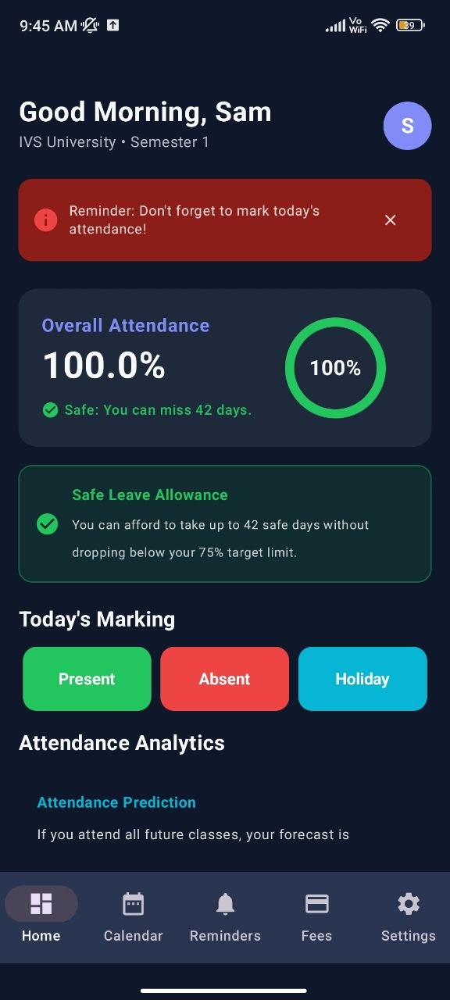
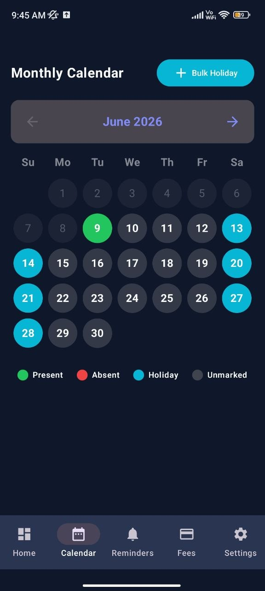
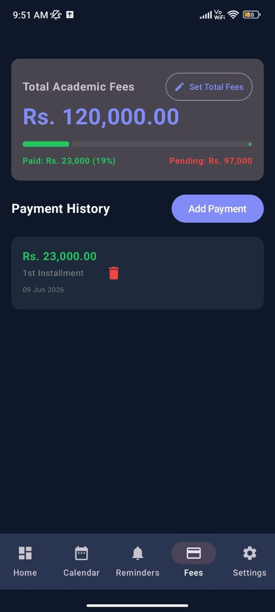
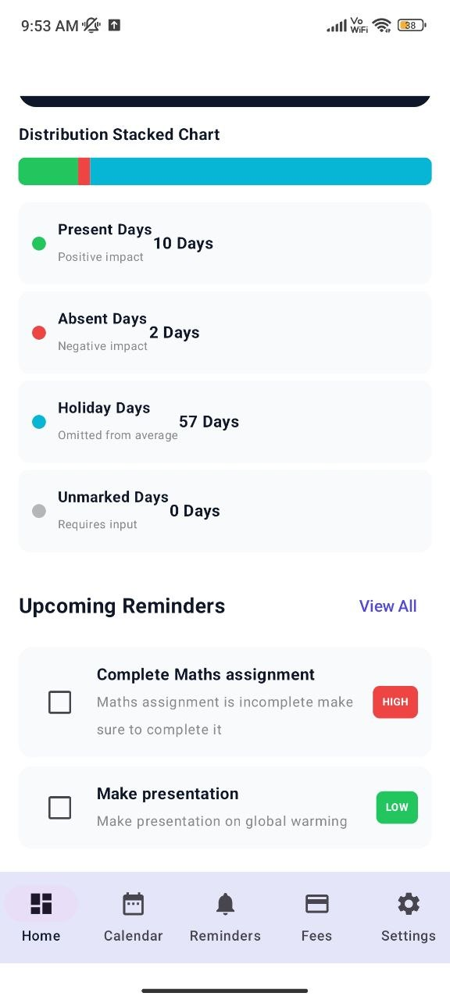

# Attendance+

Track attendance effortlessly.

Attendance+ is a modern offline-first attendance management application designed for school and college students.

No login.
No signup.
No internet required.

Everything is stored locally on your device.

---

## Features

### Attendance Tracking

✅ Daily Attendance Mode

✅ Subject-wise Attendance Mode

✅ Session-wise Attendance Mode

✅ Attendance Calendar

✅ Bulk Holiday Marking

✅ Future Attendance Planning

---

### Attendance Analytics

✅ Attendance Percentage

✅ Safe Leave Calculator

✅ Attendance Prediction

✅ Attendance Statistics

✅ Subject-wise Analytics

✅ Session-wise Analytics

---

### Academic Management

✅ Semester Support

✅ Academic Year Support

✅ Session History

✅ Editable Session Duration

✅ Editable Attendance Criteria

✅ Editable Working Days

---

### Holiday Management

✅ Automatic Weekend Holidays

✅ Indian National Holidays

✅ Festival Holidays

✅ Bulk Holiday Broadcaster

---

### Reminder System

✅ Attendance Reminder Notifications

✅ Custom Reminders

✅ Priority-based Reminder System

✅ Quick Notification Actions

---

### Fee Tracker

✅ Total Fees Tracking

✅ Payment History

✅ Remaining Fees Calculation

✅ Payment Notes

---

### Offline First

✅ No Login Required

✅ No Signup Required

✅ No Internet Required

✅ Local Device Storage

---

## Screenshots

## Home Dashboard

  

## Attendance Calendar

  

## Fee Tracker

  

## Analytics

  

---

## Installation

1. Download the latest APK from Releases.
2. Install the APK on your Android device.
3. Open Attendance+.
4. Complete onboarding.
5. Start tracking your attendance.

---

## Why Attendance+?

Most attendance apps only record attendance.

Attendance+ helps students understand:

- Current attendance percentage
- Required attendance percentage
- Safe leave allowance
- Attendance prediction
- Subject-wise attendance performance
- Session-wise attendance performance

---

## Version

Current Version: v1.0

---

## Developer

Samyak Jain

GitHub: https://github.com/Samyak2501

Self-taught Developer

---

## License

All Rights Reserved.

This repository is intended for application distribution only.

Source code is not included.
